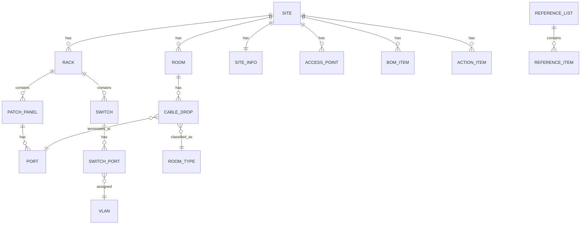

# Network Design Platform — Roadmap

Replaces the `CCU_RACKID_BLDNG_CODE_NetworkDesign*.xlsm` template (41 sheets, VBA macros,
password-gated workflow, one file per school site) with a multi-site web application.

Stack: **Python/FastAPI + PostgreSQL** (backend/API/business logic) · **React (Vite, Node
tooling) + CSS** (frontend) · optional **Node/Socket.io** layer for live multi-user editing.

## Source analysis summary

| Sheet group | Sheets | What it really is |
|---|---|---|
| Reference data | `Data Lists` | Master lookup tables (cable types, room types, VLANs, AP types, electrical specs) |
| Site metadata | `School Information`, `Site CDP Summary`, `Site Analysis` | One record per site |
| Physical docs | `Room Layout`, `Rack Elevations`, `Electrical Fiber Cabinets`, `Room Detail & Access Points`, `Proposed Access Points` | Diagrams built from merged cells/formatting |
| Cabling pipeline | `Drop List Draft` → `Patch Panel Diagram` → `Drop List As-Built` | Manual ETL via `TransposeValuesOnly` macro (24-row chunks) |
| Switch/VLAN config | `Switch Diagram`, `Switch Status`, `Switch & Port Allocation`, `VLAN Config (9300)`, `VLAN Config (2960)`, `MS390 provisioning`, `In-House Configuration` | Port/VLAN capacity math (`COUNTIFS`/`ROUNDDOWN`) + generated Cisco CLI strings |
| Program mgmt | `Action Items`, `BOM Sheet`, `Summary Check List`, `Network Summary (DOE)` | Checklists, bill of materials |
| Legacy | `PASS_1819`, `Random Tables`, `Drop List As-Built-OLD` | Not ported — dead weight from prior program years |

VBA behaviors being replaced with real code:
- **Workflow state machine** (`HideForDesign`/`HideForIntegration`/`HideForSurvey`/`HideForPortTrace`, password-gated sheet visibility) → a `site.workflow_stage` enum + role-based permissions.
- **Color-as-status** (`GetCellColor`/`CountCellsByColor` in `Module8`) → an explicit `status` column, queryable and reportable.
- **`Worksheet_Change` IP validation** → Pydantic field validators on the API.
- **`TransposeValuesOnly` drop→patch-panel ETL** → a backend function, unit-tested, run on save instead of a manual macro.
- **External workbook links** (8 found, pointing at sibling site files) → eliminated entirely; every site is a row in one database.

## Domain model (Phase 1–4 target)

`REFERENCE_LIST`/`REFERENCE_ITEM` is the generic replacement for `Data Lists` — every
dropdown in the app (cable type, room type, VLAN, AP type, electrical spec, etc.) is a row
in `reference_item` scoped by `list_key`, instead of a fixed spreadsheet column.

## Phases

**Phase 0 — Platform skeleton (this delivery)**
FastAPI app, Postgres schema for `site`, `reference_list`/`reference_item`, `room`, `rack`,
`user`/`role`, `workflow_stage`; CRUD API; xlsm importer for `Data Lists` + `School
Information`; React shell with site list/detail and a reference-data-backed dropdown
component; docker-compose dev environment.

**Phase 1 — Physical documentation (done)**
`rack_item` (equipment placed in a rack, `start_u`/`size_u`), `patch_panel` (a `rack_item`
specialization), `port` models. Server-validated overlap/capacity checks on placement and on
every move, so drag-to-place can't silently corrupt the layout. Interactive rack-elevation
UI: a U-slot grid (U1 at the bottom, matching real elevation convention) with native
drag-and-drop repositioning, an add-equipment form backed by a new `rack_equipment_type`
reference list (the old sheet never had this as a dropdown), and a patch-panel port grid for
labeling/status. Verified with pytest (21 tests, including overlap/capacity edge cases) and a
full browser-driven pass: place equipment, drag to reposition, reject an overlapping drop,
create a patch panel, edit a port.

**Phase 2 — Cabling pipeline**
`cable_drop` CRUD + the drop→patch-panel assignment logic that replaces
`TransposeValuesOnly`; as-built vs draft distinction as a `status` field, not a separate
sheet/tab.

**Phase 3 — Switch/VLAN engine**
`switch`, `switch_port`, `vlan` models; port-allocation calculator (pure function,
unit-tested) replacing the `Switch & Port Allocation` formulas; CLI-command generation for
9300/2960/MS390 as a templated export instead of hand-typed cell strings.

**Phase 4 — Program management**
`bom_item`, `action_item`, checklist views; `Network Summary (DOE)`-equivalent report
generated from live data instead of copy-pasted cells.

**Phase 5 — Collaboration**
Node/Socket.io presence + live-update layer so two people editing the same site never
diverge the way sibling `.xlsm` files do today; replaces manual "merge the other person's
copy back in."

**Phase 6 — Bulk migration**
Batch importer to pull every existing site `.xlsm` on the shared drive into the database,
with a diff/validation report per site before cutover.

## Non-goals (intentionally not ported 1:1)
- Legacy/dead sheets (`PASS_1819`, `Random Tables`, `Drop List As-Built-OLD`).
- Cell-color-as-status and password-protected sheet visibility — replaced by real fields
  and role-based permissions (strictly more capable, not a regression).
- Merged-cell "diagrams" — replaced by purpose-built UI components.
