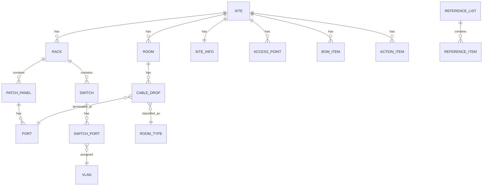

# Network Design Platform — Roadmap

Replaces the `CCU_RACKID_BLDNG_CODE_NetworkDesign*.xlsm` template (41 sheets, VBA macros,
password-gated workflow, one file per school site) with a multi-site web application.

Stack: **Python/FastAPI + PostgreSQL** (backend/API/business logic) · **React (Vite, Node
tooling) + CSS** (frontend) · optional **Node/Socket.io** layer for live multi-user editing.

## Source analysis summary

| Sheet group | Sheets | What it really is |
|---|---|---|
| Reference data | `Data Lists` | Master lookup tables (cable types, room types, VLANs, AP types, electrical specs) |
| Site metadata | `School Information`, `Site CDP Summary`, `Site Analysis` | One record per site |
| Physical docs | `Room Layout`, `Rack Elevations`, `Electrical Fiber Cabinets`, `Room Detail & Access Points`, `Proposed Access Points` | Diagrams built from merged cells/formatting |
| Cabling pipeline | `Drop List Draft` → `Patch Panel Diagram` → `Drop List As-Built` | Manual ETL via `TransposeValuesOnly` macro (24-row chunks) |
| Switch/VLAN config | `Switch Diagram`, `Switch Status`, `Switch & Port Allocation`, `VLAN Config (9300)`, `VLAN Config (2960)`, `MS390 provisioning`, `In-House Configuration` | Port/VLAN capacity math (`COUNTIFS`/`ROUNDDOWN`) + generated Cisco CLI strings |
| Program mgmt | `Action Items`, `BOM Sheet`, `Summary Check List`, `Network Summary (DOE)` | Checklists, bill of materials |
| Legacy | `PASS_1819`, `Random Tables`, `Drop List As-Built-OLD` | Not ported — dead weight from prior program years |

VBA behaviors being replaced with real code:
- **Workflow state machine** (`HideForDesign`/`HideForIntegration`/`HideForSurvey`/`HideForPortTrace`, password-gated sheet visibility) → a `site.workflow_stage` enum + role-based permissions.
- **Color-as-status** (`GetCellColor`/`CountCellsByColor` in `Module8`) → an explicit `status` column, queryable and reportable.
- **`Worksheet_Change` IP validation** → Pydantic field validators on the API.
- **`TransposeValuesOnly` drop→patch-panel ETL** → a backend function, unit-tested, run on save instead of a manual macro.
- **External workbook links** (8 found, pointing at sibling site files) → eliminated entirely; every site is a row in one database.

## Domain model (Phase 1–4 target)

`REFERENCE_LIST`/`REFERENCE_ITEM` is the generic replacement for `Data Lists` — every
dropdown in the app (cable type, room type, VLAN, AP type, electrical spec, etc.) is a row
in `reference_item` scoped by `list_key`, instead of a fixed spreadsheet column.

## Phases

**Phase 0 — Platform skeleton (this delivery)**
FastAPI app, Postgres schema for `site`, `reference_list`/`reference_item`, `room`, `rack`,
`user`/`role`, `workflow_stage`; CRUD API; xlsm importer for `Data Lists` + `School
Information`; React shell with site list/detail and a reference-data-backed dropdown
component; docker-compose dev environment.

**Phase 1 — Physical documentation (done)**
`rack_item` (equipment placed in a rack, `start_u`/`size_u`), `patch_panel` (a `rack_item`
specialization), `port` models. Server-validated overlap/capacity checks on placement and on
every move, so drag-to-place can't silently corrupt the layout. Interactive rack-elevation
UI: a U-slot grid (U1 at the bottom, matching real elevation convention) with native
drag-and-drop repositioning, an add-equipment form backed by a new `rack_equipment_type`
reference list (the old sheet never had this as a dropdown), and a patch-panel port grid for
labeling/status. Verified with pytest (21 tests, including overlap/capacity edge cases) and a
full browser-driven pass: place equipment, drag to reposition, reject an overlapping drop,
create a patch panel, edit a port.

**Phase 2 — Cabling pipeline (done)**
`CableDrop` model with `port_id` as the *only* place a drop's port assignment lives --
replacing `TransposeValuesOnly`'s manual 24-row copy/paste/transpose, and structurally
preventing the two-copies-drift problem that macro was standing in for: the Drop List and
the Patch Panel port grid both read the same row, so assigning or moving a drop (even across
patch panels) needs no separate sync step. As-built vs draft is a `status` field, not a
separate sheet. VLAN and voice-VLAN are free-text fields (deliberately not reference-list
dropdowns -- the source workbook has several different VLAN lists by room type and nothing
in it pins down which one governs the Drop List's VLAN column, so a forced dropdown would be
a guess). Assign/move/unassign API with server-side conflict checks (can't patch two drops
into the same port), a site-wide ports endpoint for populating assignment pickers, an
upsert-by-drop-number bulk import (CSV paste in the UI) that reports per-row errors without
failing the whole batch, and a Drop List UI wired to the same shared-refresh signal as the
rack elevation view so a change in either shows up in the other immediately. Verified with
pytest (38 tests total, including "move a drop between two different patch panels updates
the Drop List" and "one bad room name in a bulk import doesn't sink the other rows") and
full browser-driven passes confirming the cross-view instant reflection and the bulk-import
partial-failure UX.

**Phase 3 — Switch/VLAN engine (done)**
`Switch`/`SwitchPort` (a `RackItem` specialization, same pattern as `PatchPanel`) and a
per-site `Vlan` model. `CableDrop.switch_port_id` extends the single-source-of-truth pattern
from Phase 2 one hop further down the physical chain: a drop's patch-panel port and its
switch cross-connect are independent fields on the same row, so the Drop List's new "Switch
Port" column, the switch's own port grid, and moving a drop between switches (even across
different switches) all read/write the same fact. Port-allocation calculator
(`app/services/port_allocation.py`) is an explicitly clean-room reimplementation of the
`Switch & Port Allocation` sheet's *intent*, not its formulas -- those referenced hidden
helper cells in ways not safely reverse-engineerable from a blank template, so faking that
fidelity would have been worse than being upfront about writing a fresh, tested algorithm.
CLI export generates real Cisco IOS interface config for 9300/2960-class switches and a
Meraki-API-shaped JSON port list for MS-series (Meraki doesn't use IOS-style CLI, so it
doesn't get fake CLI text) — both derived live from the same relational port data the UI
edits, replacing the hand-typed `Commands` column in `VLAN Config (9300)`/`(2960)`.

Verified with pytest (79 tests) and full browser-driven passes (VLAN + switch-port config +
drop cross-connect + move-between-switch-ports + calculator + config download). Two real
bugs were caught only by testing against a real Postgres instance instead of just SQLite (the
project's target per `docker-compose.yml`, but pytest's fixtures use SQLite for speed):
SQLAlchemy's `Enum` column type persists a Python enum member's *name* by default, not its
*value* (`WorkflowStage.SURVEY` → `"SURVEY"`), which SQLite's default-off CHECK constraints
never caught but Postgres's native enum types rejected outright — fixed with a
`values_callable` helper (`app/database.py::str_enum`) used by every enum column. A second
bug (a missing conditional in `SwitchPorts.jsx` that always rendered a port's number instead
of its assigned drop) was only visible by actually reading the rendered page, not by any
automated check. Both are a good reminder that this project's SQLite-only pytest suite is
fast but not sufficient on its own — Postgres and the browser are where the real coverage is.

**Phase 4 — Program management**
`bom_item`, `action_item`, checklist views; `Network Summary (DOE)`-equivalent report
generated from live data instead of copy-pasted cells.

**Phase 5 — Collaboration**
Node/Socket.io presence + live-update layer so two people editing the same site never
diverge the way sibling `.xlsm` files do today; replaces manual "merge the other person's
copy back in."

**Phase 6 — Bulk migration**
Batch importer to pull every existing site `.xlsm` on the shared drive into the database,
with a diff/validation report per site before cutover.

## Non-goals (intentionally not ported 1:1)
- Legacy/dead sheets (`PASS_1819`, `Random Tables`, `Drop List As-Built-OLD`).
- Cell-color-as-status and password-protected sheet visibility — replaced by real fields
  and role-based permissions (strictly more capable, not a regression).
- Merged-cell "diagrams" — replaced by purpose-built UI components.
